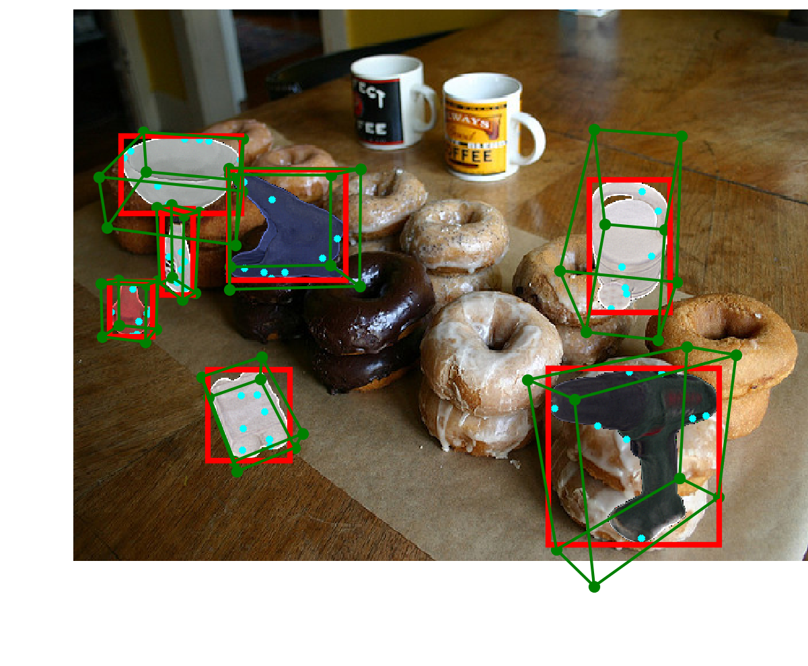
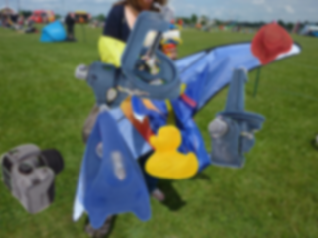

# 6dpose.gendata

Tools for generating synthetic 6DoF pose estimation training images. Now it only supports SIXD's hinterstoisser dataset.

## Download Dataset

- [SIXD](http://cmp.felk.cvut.cz/sixd/challenge_2017/)

## Workflow

1. Generate keypoints followed the instructions in [kps/README.md](kps/README.md)
2. Load rendered images from `$SIXDROOT/train/rgb`
3. Load background images from `$COCOROOT`
4. Stick rendered images into background with some data augumentation
5. Save annotation
    - bounding box
    - keypoints position
    - pose

## Example

Normal

Gaussian blur

Motion blur

## TODO

- [x] Basic
    - [x] ~~Load SIXD information~~
    - [x] ~~Generate keypoints~~
    - [x] ~~Stick image~~
    - [x] ~~Save annotation~~
        - [x] ~~Bounding box~~
        - [x] ~~Pose~~
        - [x] ~~Keypoints~~
    - [x] ~~Data augmentation~~
        - [x] ~~Scale~~
        - [x] ~~Motion blur~~
        - [x] ~~Gaussian blur~~
        - [x] ~~Box blur~~
- [ ] Advanced
    - [ ] Lighting
    - [ ] Texture
