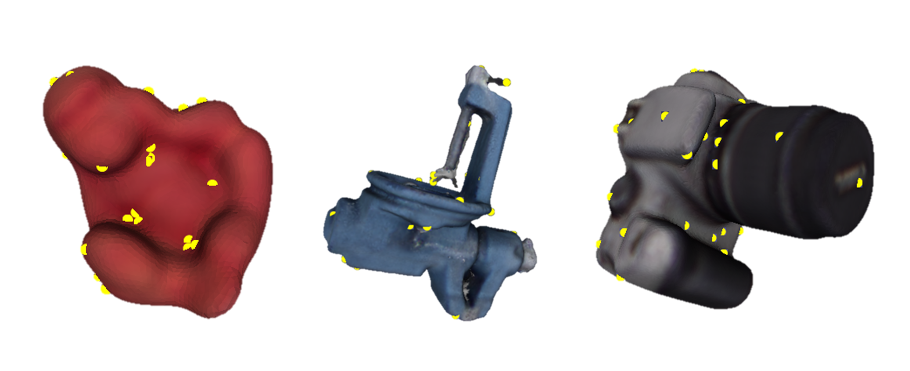

# Keypoints

## How to Generate

1. Install PCL libirary
2. Modify parameters in `pcl-sift/main.cpp`
    ```cpp
    const float min_scale = 0.3f;
    const int n_octaves = 10;
    const int n_scales_per_octave = 8;
    const float min_contrast = 0.2f;
    ```
3. Generate keypoints. Here I only modify `min_contrast` to control the number of keyponits.
    ```bash
    $ cd pcl-sift
    $ sh compile.sh  # compile
    $ cd build
    $ # ./pcl-sift path/to/models /path/to/save min_contrast
    $ ./pcl-sift models/obj_01.ply /sifts/obj_01.ply 0.5
    ```

## Example



## Parameters

Good keypoints should be distributed uniformly around the object mesh surface.

| object | `min_scale` | `n_octaves` | `n_scales_per_octave` | `min_contrast` | # keypoints |
| --- | --- | --- | --- | --- | --- |
| 01 ape | 0.3 | 10 | 8 | 0.158 | 30 |
| | | | | 0.265 | 17 |
| | | | | 0.4 | 9 |
| 02 benchvise | 0.2 | 10 | 8 | 0.671 | 30 |
| | | | | 1.0 | 17 |
| 03 bowl | 0.2 | 10 | 8 | 0.306 | 30 |
| | | | | 0.42 | 17 |
| 04 camera | 0.2 | 10 | 8 | 0.247 | 30 |
| | | | | 0.3285 | 17 |
| 05 can | 0.2 | 10 | 8 | 0.512 | 30 |
| | | | | 0.7725 | 17 |
| 06 cat | 0.2 | 10 | 8 | 0.32 | 30 |
| | | | | 0.625 | 17 |
| 07 cup | 0.2 | 10 | 8 | 0.2444 | 30 |
| | | | | 0.3385 | 17 |
| 08 driller | 0.2 | 10 | 8 | 0.425 | 30 |
| | | | | 0.7 | 17 |
| 09 duck | 0.2 | 10 | 8 | 0.19 | 30 |
| | | | | 0.26 | 17 |
| 10 eggbox | 0.2 | 10 | 8 | 0.27 | 30 |
| | | | | 0.4 | 17 |
| 11 glue | 0.2 | 10 | 8 | 0.21799 | 30 |
| | | | | 0.28 | 17 |
| 12 holepuncher | 0.2 | 10 | 8 | 0.489 | 30 |
| | | | | 0.57 | 17 |
| 13 iron | 0.2 | 10 | 8 | 0.575 | 30 |
| | | | | 0.7225 | 17 |
| 14 lamp | 0.2 | 10 | 8 | | 30 |
| | | | | 0.97 | 17 |
| 15 phone | 0.2 | 10 | 8 | 0.3175 | 30 |
| | | | | 0.43 | 17 |
